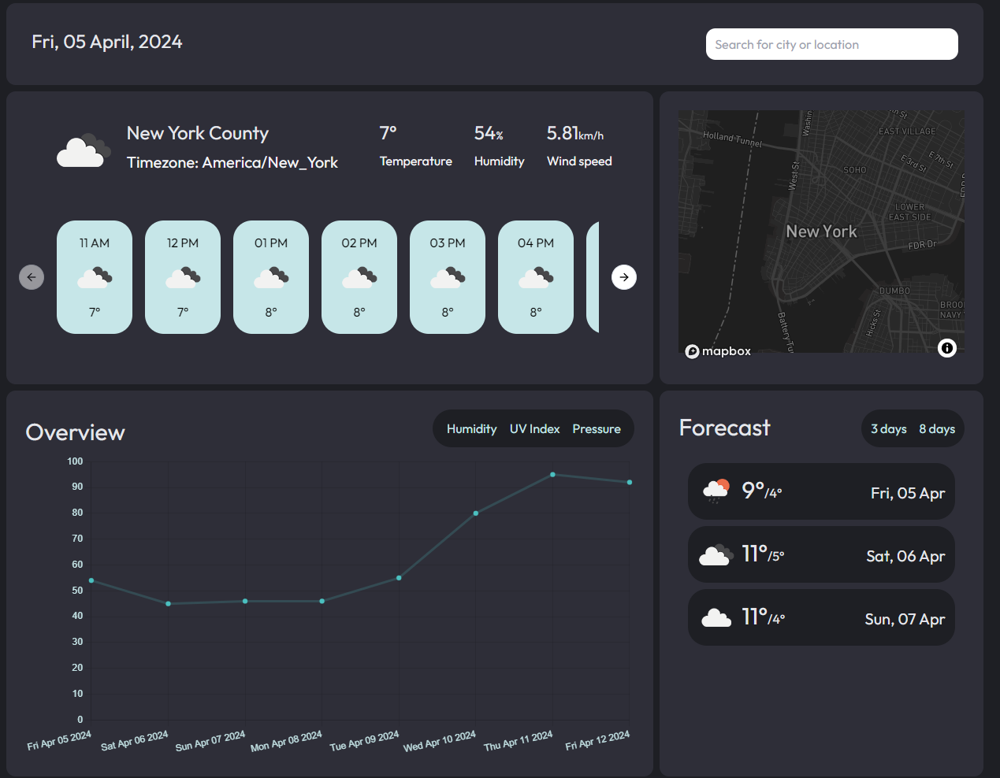

# Web Weather Application

## An web application used to search current weather in any desired locations

## Project status

The project has been finished. User can search for any location, and see the different weather stats like: precipitation, temperature,
forecast etc.

## Project Screen Shot

## Installation and Setup Instructions

Clone down this repository. You will need `node` and `yarn` installed globbally on your machine.

Installation: 
`yarn install`

After installation create a .env file. In this file add `VITE_WEATHER_API_KEY`and `VITE_MAPBOX_API_KEY`: 
The key for `VITE_WEATHER_API_KEY` can be found [here](https://openweathermap.org/api). 
The key for `VITE_MAPBOX_API_KEY`can be found [here](https://www.mapbox.com/).

To start the application locally: 
`yarn dev`

For visiting the app a link will pe provided in console.

## Reflection

This project represent an example which integrates different technologies for creating a responsive web application for real-time
weather data visualization. For fetching the real-time weather data, the Weather API was utilized. For map view, Mapbox API was
used, which offers users and intercative map view. UI inspiration: https://dribbble.com/shots/21505269-Weather-Dashbard-App.
